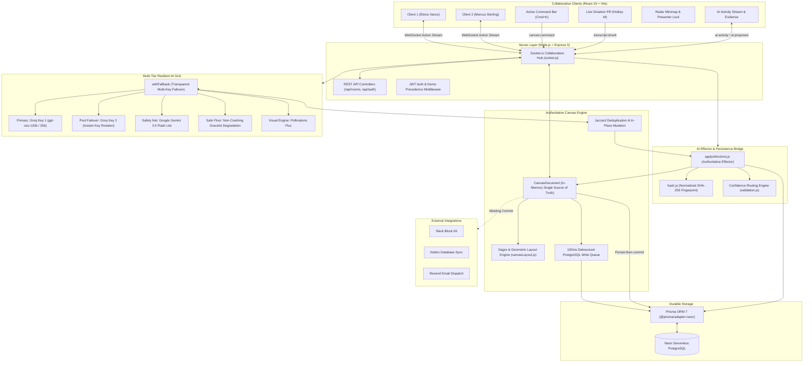
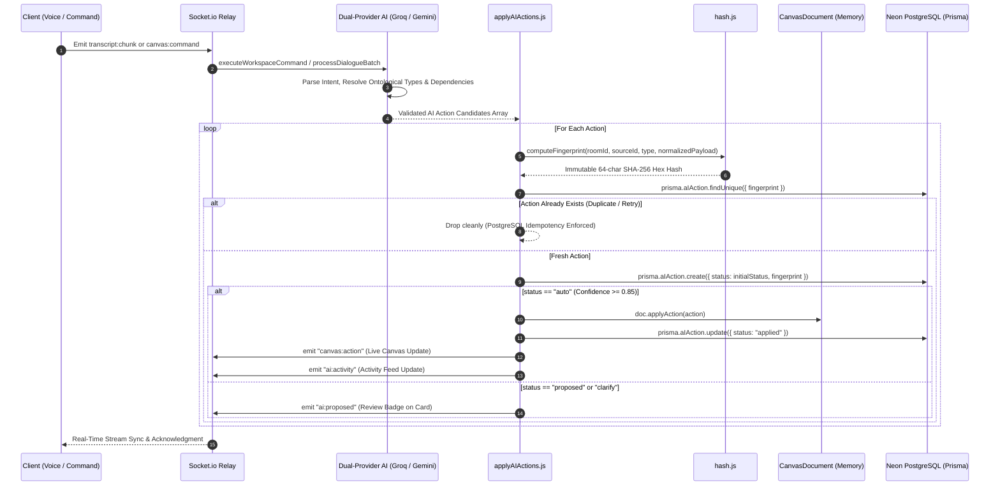

# mindMesh — Architecture & Deep-Dive Reference

This is the technical companion to [README.md](README.md). The README is the pitch and the quick start; this document is everything else — the full product tour, system diagrams, data ontology, engineering invariants, API/WebSocket reference, repository layout, test suites, and production deployment steps.

---

## 🗺️ Full Product Tour

### 1. 🎙️ Live Speech-to-Graph Synthesis
- **Zero-Friction Dictation**: Click the **Dictate** button in the header or hit **`M`** to toggle continuous voice dictation with browser silence recovery.
- **Web Speech API & Silence Recovery**: Native live speech-to-text directly in-browser, with 200ms debounced silence recovery to prevent Chromium silence timeouts. **Chrome and Edge only** — both ship Google's server-side speech backend behind `webkitSpeechRecognition`. Brave deliberately strips that backend out of its build (a privacy-motivated exclusion, not a bug on either side — see [Brave's own tracking issue](https://github.com/brave/brave-browser/issues/18569)), so dictation always fails there with a `network` error regardless of Shields settings; Firefox and Safari don't support the API reliably either. Everything else in mindMesh (canvas, video, AI actions) works in any modern browser.
- **Interim Caption Stream**: Watch your spoken words stream into a floating pill right above the active command bar before they materialize into graph cards.

### 2. ⚡ Multi-Key Resilient AI Grid (Zero-Downtime Failover)
- **Primary Engine**: Multi-key Groq LPU pool running **Llama 3.3 70B / GPT-OSS 120B & 20B** for fast structured JSON inference. Key rotation and burst failover across the pool.
- **Secondary Safety Net**: Google **Gemini 3.5 Flash Lite** transparently absorbs high-volume dialogue spikes via a round-robin multi-key pool.
- **Zero-Crash Graceful Degradation**: If all upstream LLMs are unavailable, live speech extraction degrades safely without crashing the room (`status: "failed"` with empty action set), while the Meeting Commit Engine falls back to a deterministic qualitative summary (`generateDeterministicSummary`).
- **Confidence Routing**:
  - High confidence (≥ 0.85): Auto-applied to the canvas instantly.
  - Medium confidence (0.50–0.85): Displayed in the collapsible AI Activity Stream with one-click **Apply** / **Dismiss** chips.
  - Low confidence (< 0.50): Highlighted with an amber review warning.

### 3. 📋 Strategic Agenda Intake & Live Topic Cascading
- **Pre-Meeting & Live Agenda Ingestion**: Click the **Agenda** button in the workspace header to open the Paste Agenda Modal. Paste raw markdown bullets, sprint notes, or Jira deliverables.
- **Automatic Pillar Extraction**: The AI extracts 3–5 top-level strategic topic pillars (`type: "goal"`), positioning them horizontally as anchor roots across the top of the canvas.
- **Live Dialogue Cascading**: As attendees speak, newly extracted tasks, decisions, and risks automatically link to their parent agenda pillar via `part_of` or `depends_on` directed edges, forming clear downward visual trees.
- **Three-Layer Defense-in-Depth**: Strict schema validation (`fromSemanticKey`/`toSemanticKey`), action validation key normalization, and canvas deduplication fallback so parent-child relationships never break.

### 4. 📐 Server-Authoritative Dagre Layout Engine
- **Kahn's Topological Sort (Diamond-Safe)**: Ensures prerequisite parent cards are fully ranked before dependent children (a diamond dependency A→B, A→C, B→D, C→D correctly places D at rank 2, never rank 1).
- **3-Color DFS Cycle Breaking**: Safely detects back-edges (`WHITE`, `GRAY`, `BLACK`) to eliminate circular dependencies without recursion crashes.
- **Barycentric Crossing Minimization**: Orders nodes horizontally within each tier by averaging predecessor X coordinates.
- **Collision-Free Geometry**: Spaced strictly by 360×200px strides (280×140px cards), mathematically guaranteeing zero overlap.
- **One-Click Tidy**: Click **Tidy Graph** on the floating toolbar, or type `/layout hierarchical` in the command bar. The viewport re-frames after layout so nodes never land under fixed UI chrome.

### 5. 🎨 Generative Visual Concepts (Pollinations.ai)
- Visual cards (`node.type === "image"`) render high-resolution architectural diagrams and creative concept artwork inline on the canvas.
- Click any visual card to launch the Visual Lightbox Inspection Modal for full-resolution view, prompt inspection, and downloads.
- Automatic retry lifecycle with jitter and fallback rendering on slow network connections.

### 6. 👥 Multiplayer Presence, Radar Minimap & Context Zones
- **Live Cursors**: Canvas-space transformed cursors throttled to 35ms with smooth CSS transform interpolation and name badges.
- **Radar Minimap**: Bottom-right interactive radar projecting all canvas cards and peer viewports; click or drag anywhere to jump instantly.
- **Follow Me Presenter Broadcast**: Single-presenter concurrency lock allows a speaker to guide all attendees' viewports.
- **Context Zones**: Mark, name, and bound important regions on the infinite canvas — dashed visual frames, coordinate tags, a left-dock tool, and a quick-jump drawer with real-time multiplayer sync (`zone:created`, `zone:deleted`).
- **Dual Meeting Modes**: **Operational** (structured columns, task assignments, chronological deliverables) and **Brainstorm** (organic visual clustering and associative idea maps).

### 7. 📹 Peer-to-Peer WebRTC Video Calling
- **Low-Latency P2P Mesh**: Audio and video streams flow directly between attendee browsers via Google STUN servers with zero server media bandwidth overhead.
- **4-Participant Beta Mesh Ceiling**: Enforced at room join to maintain optimal browser CPU and upstream P2P bandwidth.
- **Dockable Video Conference Bar**: Floating dock positioned above the canvas, featuring mirrored local video, remote peer tiles, and live mic status indicators.
- **Ambient Avatar Fallbacks**: Graceful fallback to initialed colored avatars if cameras are disabled or permission is denied.
- **Synchronous Signaling Locks**: Hardened against duplicate offer collisions and out-of-order ICE candidate trickling; the signaling relay only forwards offer/answer/ICE traffic between sockets that share the same room.

### 8. 🏁 Dual-Source Meeting Commit & External Integrations
- Click **Commit Call** to synthesize both the final canvas knowledge graph and raw conversational dialogue into an executive `MeetingReport`.
- Celebratory confetti animation upon commit confirmation.
- Direct outward dispatches: **Slack** (formatted Block Kit payload) and **Notion** (complete database page and block hierarchy).

### 9. 🌐 Landing Page & Brand Architecture
- Proprietary geometric brand mark, sticky glassmorphic navigation, zero-jitter CSS Grid FAQ accordion.
- Fully responsive from 320px mobile viewports through 4K desktop, zero horizontal overflow.
- React Router v7 navigation (`/`, `/dashboard`, `/login`, `/register`, `/join/:token`, `/room/:roomId`), with every route except the landing page lazy-loaded via `React.lazy`/`Suspense`.

### 10. 🔐 Authentication & Multi-Tenancy
- `/login` and `/register` with a responsive split layout and a dark showcase panel.
- **Dual-token cookie lifecycle**: `session` (15-minute rotating JWT access token, `httpOnly`, `path: /`) and `refresh` (7-day, `httpOnly`, restricted to `/api/auth`). A transparent Axios interceptor rotates the session token on 401 and replays the failed request.
- **Rate limiting across every sensitive surface**: signup/login (15 req/15min/IP), refresh (30/15min/IP), invite resolution & join (30/15min/IP), room creation (20/15min/IP — the demo flow stays signup-free but throttled, not unbounded), and AI-triggered routes (30/5min/IP). The `canvas:command` Socket.io event carries its own per-socket in-memory limiter, since HTTP rate limiting doesn't cover the WebSocket transport.
- **Active Refresh Token Session Ceiling (`MAX_SESSIONS = 10`)**: oldest sessions pruned automatically on multi-device sign-in.
- **Multi-tenant isolation & RBAC**: `requireRoomAccess` enforces room membership; room deletion and integration-credential writes are owner-gated (`403` for non-owners/guests); `listRooms(userId)` returns only the caller's own rooms; `PATCH /api/rooms/:roomId` writes through an explicit field whitelist (`name`, `mode`, `systemContext`) rather than the raw request body.
- **Room-scoped socket authority**: every real-time handler (`canvas:join`, `room:join`, `transcript:chunk`, WebRTC signaling) trusts only the server-assigned `socket.data.roomId`, never a client-supplied payload value.

### 11. 🎟️ Guest Invite System
- Workspace owners generate tokenized `/join/:token` URLs with configurable member or guest privileges.
- Guests receive a signed `guest_session` cookie scoped to the invited `roomId` — enforced at both the HTTP layer and every socket room-join event, so a guest token minted for one room cannot be used to join a different one.
- Guest identity lives in tab-scoped `sessionStorage`, never permanent `localStorage`.
- Logged-in users opening an invite link are upserted as permanent `RoomMember` records instead of getting a temporary guest cookie.

### 12. 🛡️ Production & Cross-Domain Hardening
- Cookies adapt flags by environment (`sameSite: isProd ? "none" : "lax"`, `secure: isProd`) for cross-domain deployments (Vercel + Render) with `credentials: true`.
- CORS allowlist (`config.clientUrl` + `ALLOWED_ORIGINS`) is always enforced; outside strict production it additionally permits localhost dev origins only — never a wildcard.
- Slack webhook URLs are validated against a `hooks.slack.com` allowlist before the server ever fetches them, and only the room owner can set them, closing an SSRF path.
- Room integration settings mask sensitive credentials (Slack webhooks, Notion keys) before they ever reach the client.
- Unexpected database-layer errors are masked to a generic message in responses; deliberate, user-facing validation errors are left intact.
- **Canvas persistence is room-scoped end-to-end, not just at the socket layer.** The realtime hub already enforced `socket.data.roomId` as the sole source of truth for which room a mutation applies to — but the database write underneath (`canvasPersistence.js`) used to key `CREATE_NODE`/`UPDATE_NODE`/`MOVE_NODE`/`CREATE_EDGE` on the entity's global id alone, so a client that knew another room's node id (any past member, any removed guest) could overwrite that room's persisted content while the write appeared scoped to their own room in-memory. Every write path now verifies room ownership before it's allowed to touch a row (`updateMany`'s full-filter `where` for updates, an explicit ownership pre-check before `upsert` for creates, since Prisma's `upsert` can't filter by a second field).
- **Refresh-token rotation is now safe under concurrent tabs.** Rotation used to be strict single-use with no grace window: two tabs whose access tokens expired together would race to refresh with the same cookie, and the loser's rotation attempt was indistinguishable from genuine token theft — triggering the reuse-detection safety net to revoke every session for that user. A short-lived single-flight cache now lets a same-token replay within the rotation window join the in-flight rotation instead of being treated as an attack.
- **Guest identity can no longer be spoofed or collided.** A guest's identity used to be derived purely from their typed display name (`guest-${name}`), so any guest could type an existing teammate's name and have their edits attributed under that identity, or two guests with the same typed name would literally collide into one identity. Each guest session now carries its own random identity component alongside the display name.

> **Known, deliberately open items**: no per-call timeout on Groq/Gemini API requests, no `helmet` security headers, room-integration credentials are stored as plaintext JSON rather than encrypted at rest, and Paste-Agenda isn't coordinated with the live-dialogue extraction queue's single-flight lock (a narrow concurrent-mutation window, not a security issue). None of these block normal use — they're the next hardening pass, not silent gaps.

### 13. 🌌 404 Page & Performance
- A dedicated, on-brand 404 page rather than a generic error screen.
- Vite manual chunk-splitting isolates vendor dependencies (React, Socket.io, Lucide icons) from app code, plus route-level `React.lazy` splitting so the canvas/WebRTC/speech stack never loads for a visitor who only sees the landing page.
- Vercel SPA rewrites so direct navigation to any subpath (`/room/:roomId`, `/join/:token`, `/dashboard`) resolves correctly.

---

## 🏛️ System Architecture



---

## ⚡ Real-Time AI Action & Idempotency Pipeline



---

## 🧭 The Canvas Knowledge Ontology

Every piece of conversational intelligence becomes one of **8 node types**, connected through **8 semantic relationship edges**.

### Node Types

| Type | Icon | Color Accent | Purpose & Behavior |
| :--- | :---: | :---: | :--- |
| **Goal** | 🎯 | Amber | Strategic milestones, high-level objectives, and sprint deliverables. |
| **Idea** | 💡 | Teal | Creative concepts, exploratory thoughts, architectural hypotheses. |
| **Task** | ✅ | Emerald | Assignable action items with interactive completion checkboxes. |
| **Decision** | 🧭 | Rust (Accent) | Finalized architectural choices, consensus agreements, approvals. |
| **Question** | ❓ | Plum | Open inquiries, missing requirements, clarification requests. |
| **Risk** | 🔴 | Rose | Technical debt, blockers, single points of failure, security risks. |
| **Person** | 👤 | Slate | Stakeholders, meeting participants, and action item assignees. |
| **Visual** | 🖼️ | Clay | Generative diagrams, system mockups, visual concept cards. |

### Edge Relationships

- `blocks` — prerequisite blocker between tasks/risks
- `depends_on` — directed dependency requirement
- `leads_to` — causal chain or sequential outcome
- `supports` — evidence or rationale supporting an idea/decision
- `contradicts` — conflicting viewpoint or architectural objection
- `related_to` — associative connection between related topics
- `assigned_to` — person-to-task ownership edge
- `part_of` — hierarchical decomposition into a goal or cluster

---

## 🛡️ Hardened Engineering Invariants

1. **Persist-Then-Commit Ordering**: All non-debounced canvas actions persist to Neon PostgreSQL before updating in-memory `CanvasDocument` state, preventing silent memory drift if a database write fails.
2. **Deterministic Payload Hashing**: Object keys are recursively sorted via `normalizePayload()` before SHA-256 fingerprinting (`roomId:sourceId:type:normalizedPayload`), so duplicated network packets or retries are idempotently ignored.
3. **Single-Flight Coalescing Queue**: Guarantees only one speech extraction request is in flight per room at any time, protecting LLM rate limits while preserving conversation order.
4. **9-Second Monologue Ceiling Window**: Long continuous single-speaker utterances force-flush extraction within 9 seconds, preventing delayed graph updates.
5. **Signal-Safe Fluff Filter**: Discards filler ("yeah", "uh-huh", "sounds good") to conserve token quota, while `ACTION_MARKERS` ("not", "instead", "assign", "wait", "actually") strictly safeguard decision handoffs from being filtered out.
6. **Diamond-Safe Topological Dagre**: Kahn's topological sort with in-degree queues ensures diamond-shaped dependency sinks are placed at the correct rank, never prematurely.
7. **Collision-Free Coordinates**: Spaced by 360×200px strides (280×140px cards), guaranteeing no two cards ever overlap.
8. **End-to-End Data Lineage (`sourceId`)**: Nodes store their originating `AIAction.id`, so clicking any card's "Why This Exists" button shows the verbatim transcript quote and reasoning behind it.
9. **Consistent Loading States**: Shimmering skeleton loaders across canvas load states, visual lightbox, and command reasoning bars — no raw circular spinners.
10. **Bounded Session Invariant (`MAX_SESSIONS = 10`)**: Active refresh tokens are capped at 10 per user with automatic oldest-first pruning, keeping token rotation and bcrypt verification bounded.
11. **Foreign-Key Protected Transcript Ingestion**: `transcript:chunk` guarantees the room entity exists (`getOrCreateRoom`) before persisting, so ad-hoc meeting rooms never drop conversational transcripts.

---

## 📡 API & WebSocket Reference

### Unified REST Response Contract
- **Success**: `{ "success": true, "message": "...", "data": { ... } }`
- **Failure**: `{ "success": false, "message": "...", "errors": [ ... ] }`

### Core REST Endpoints

| Method | Endpoint | Auth | Description |
| :--- | :--- | :---: | :--- |
| `GET` | `/api/health` | Public | Service uptime, database connection, and environment health check. |
| `POST` | `/api/auth/signup` | Public (Rate-Limited) | Registers account (bcrypt-hashed), sets 15m `session` & 7d `refresh` cookies. |
| `POST` | `/api/auth/login` | Public (Rate-Limited) | Authenticates credentials and issues environment-aware `httpOnly` cookies. |
| `POST` | `/api/auth/refresh` | Cookie (`refresh`), Rate-Limited | Rotates session token and issues a fresh 15m `session` cookie. |
| `POST` | `/api/auth/logout` | Public | Clears `session` and `refresh` cookies across domains. |
| `GET` | `/api/auth/me` | Session Cookie | Validates session token and returns the current authenticated user profile. |
| `GET` | `/api/rooms` | Session Cookie | Lists workspaces scoped strictly to caller's memberships (`[]` if unauthenticated). |
| `POST` | `/api/rooms` | Public, Rate-Limited | Creates a workspace and registers the creator as `"owner"` if authenticated. |
| `GET` | `/api/rooms/:roomId` | `requireRoomAccess` | Room metadata, active canvas state, and member authorization check. |
| `PATCH` | `/api/rooms/:roomId` | `requireRoomAccess` | Updates room `name`/`mode`/`systemContext` via an explicit field whitelist. |
| `DELETE` | `/api/rooms/:roomId` | Owner Only | Permanently deletes workspace (`403` for non-owners). |
| `POST` | `/api/rooms/:roomId/invites` | Owner Only | Generates a disposable invite token for room sharing. |
| `GET` | `/api/invites/:token` | Public, Rate-Limited | Resolves invite metadata (`roomId`, `roomName`). |
| `POST` | `/api/invites/:token/join` | Public, Rate-Limited | Joins workspace; upserts `RoomMember` for real users or issues an 8h `guest_session`. |
| `GET` | `/api/rooms/:roomId/ai-actions` | `requireRoomAccess` | Fetches historical `AIAction` feed for Activity Stream hydration. |
| `POST` | `/api/rooms/:roomId/ai-actions/:id/approve` | `requireRoomAccess` | Approves and executes a proposed action via REST. |
| `POST` | `/api/rooms/:roomId/ai-actions/:id/reject` | `requireRoomAccess` | Dismisses a proposed action and marks it `rejected`. |
| `POST` | `/api/rooms/:roomId/agenda` | `requireRoomAccess`, Rate-Limited | Ingests a meeting agenda, extracts 3–5 strategic pillars, and seeds anchor roots. |
| `GET` | `/api/rooms/:roomId/zones` | `requireRoomAccess` | Fetches saved spatial context zones and camera bookmarks for the room. |
| `POST` | `/api/rooms/:roomId/zones` | `requireRoomAccess` | Creates a new named context zone (`name, x, y, zoom`). |
| `DELETE` | `/api/rooms/:roomId/zones/:zoneId` | `requireRoomAccess` | Deletes a context zone with room-scoped boundary checks. |
| `GET` | `/api/rooms/:roomId/integrations` | `requireRoomAccess` | Fetches external integrations with sensitive webhooks/keys masked. |
| `PUT` | `/api/rooms/:roomId/integrations/:provider` | Owner Only | Configures a Slack/Notion integration; Slack webhook URLs are allowlist-validated. |
| `POST` | `/api/rooms/:roomId/commit` | `requireRoomAccess` | Synthesizes the dual-source executive report and dispatches to Slack/Notion. |

### Real-Time Socket.io Events

| Event Name | Direction | Payload & Description |
| :--- | :---: | :--- |
| `canvas:join` | `C ──► S` | `{ roomId }`: Joins room, returns authoritative `canvas:init`, broadcasts presence. Rejected if the caller's guest token is scoped to a different room. |
| `canvas:action` | `C ◄──► S` | `{ action }`: Atomic canvas mutation (`CREATE_NODE`, `MOVE_NODE`, etc.), scoped to the socket's authoritative room. |
| `canvas:batch_action` | `C ◄──► S` | `{ actions: [...] }`: Batch transactional canvas mutations. |
| `canvas:command` | `C ──► S` | `{ prompt, workspaceContext }`: Natural language command (`"/layout hierarchical"`); per-socket rate-limited. |
| `transcript:chunk` | `C ──► S` | `{ chunk: { id, speaker, text, timestamp } }`: Live speech stream, scoped to the socket's joined room only. |
| `cursor:move` | `C ──► S` | Throttled `(x, y)` coordinates broadcast to peers as `cursor:moved`. |
| `presence:presenter-start` | `C ──► S` | Requests atomic single-presenter broadcast lock. |
| `zone:created` | `S ──► C` | `{ id, name, x, y, zoom }`: Broadcasts newly created context zone to all room peers. |
| `zone:deleted` | `S ──► C` | `{ zoneId }`: Broadcasts deleted context zone ID to all room peers. |
| `ai:activity` | `S ──► C` | Real-time broadcast of newly applied `AIAction` row. |
| `ai:proposed` | `S ──► C` | Broadcast of an action requiring user review and approval. |
| `webrtc:offer` / `answer` / `ice-candidate` | `C ◄──► S` | Relays SDP/ICE traffic to a target peer socket, only if both sockets share a room. |
| `webrtc:media-state` | `C ──► S` | Broadcasts mic mute and camera toggle status to the caller's own room. |
| `webrtc:peer-left` | `S ──► C` | Notifies room peers on disconnect to clean up video elements. |

---

## 📁 Repository Structure

```
mindMesh/
├── client/                               # React 19 + Vite Frontend
│   ├── src/
│   │   ├── api/                          # REST & WebSocket client instances (with auto-refresh 401 interceptor)
│   │   ├── components/
│   │   │   ├── auth/                     # GuestJoinModal (frictionless room share dialog)
│   │   │   ├── landing/                  # Navbar, Hero, HowItWorks, Workspaces, Comparison, FAQ, Footer
│   │   │   ├── canvas/                   # InfiniteCanvas, CanvasNode, CanvasEdge, VisualLightboxModal, Minimap
│   │   │   ├── command/                  # ActiveCommandBar (floating command bar)
│   │   │   ├── activity/                 # ActivityStream & EvidenceCard
│   │   │   ├── meeting/                  # CommitCallModal, PasteAgendaModal, SpeechIntelligenceController, VideoConferenceBar
│   │   │   ├── dashboard/                # DashboardHeader
│   │   │   ├── presence/                 # PresenterFollowBanner
│   │   │   └── ui/                       # BrandLogo, WorkspaceHeader, ErrorBoundary, menus/, modals/
│   │   ├── context/                      # RoomContext, AuthContext (JWT & guest auth lifecycle)
│   │   ├── hooks/                        # useCanvas, useAIActions, useSpeechRecognition, useWebRTC, useAuth, useTheme, useEscapeKey
│   │   ├── pages/                        # LandingPage, DashboardPage, GuestJoinPage, RoomPage, NotFoundPage
│   │   │   └── auth/                     # LoginPage, RegisterPage, AuthShowcase
│   │   ├── app.routes.jsx                # React Router v7 routes, lazy-loaded pages & navigation hooks
│   │   └── utils/                        # canvasConstants, color tokens, layout helpers
│   ├── vercel.json                       # Vercel SPA client route rewrites
│   └── package.json
│
├── server/                               # Node.js + Express 5 Backend
│   ├── prisma/
│   │   ├── schema.prisma                 # 13 PostgreSQL data models (User, RoomMember, Room, AIAction, MeetingReport, etc.)
│   │   └── seed.js                       # Elena & Marcus demo seeding
│   ├── src/
│   │   ├── ai/
│   │   │   ├── applyAIActions.js         # Authoritative effector service & DB persistence
│   │   │   ├── agenda.js                 # Strategic agenda pillar extraction
│   │   │   ├── extraction.js             # Live speech-to-graph extraction engine
│   │   │   ├── commands.js               # Workspace command execution engine
│   │   │   ├── validation.js             # Action-shape validation & confidence routing
│   │   │   ├── prompts/                  # extraction, agenda, command & summary prompts
│   │   │   └── providers/                # Groq (multi-key pool) & Gemini fallback
│   │   ├── canvas/
│   │   │   ├── canvasDocument.js         # In-memory single source of truth
│   │   │   ├── canvasLayout.js           # Dagre & geometric spatial layout engine
│   │   │   ├── canvasDeduplication.js    # Jaccard token & semanticKey mutator
│   │   │   ├── canvasPersistence.js      # Neon PostgreSQL Prisma writer
│   │   │   ├── canvasValidation.js       # Payload schema validators
│   │   │   └── canvasActions.js          # Action application to the in-memory document
│   │   ├── controllers/                  # auth, room, invite, report, ai controllers
│   │   ├── services/                     # auth, guest, room, presence, ai services
│   │   ├── middlewares/                  # auth (requireRoomAccess), rateLimit, validation, error
│   │   ├── realtime/
│   │   │   ├── socket.js                 # Socket.io bootstrap with production origin whitelisting
│   │   │   ├── canvas.socket.js          # Canvas action & authoritative join handshake
│   │   │   ├── room.socket.js            # Room channel join/leave lifecycle
│   │   │   ├── transcript.socket.js      # Live speech streaming & chunk persistence
│   │   │   ├── webrtc.socket.js          # WebRTC P2P signaling relay
│   │   │   └── presence.socket.js        # Multiplayer cursor & presenter relays
│   │   ├── routes/                       # REST API routes (auth, room, ai, invite)
│   │   ├── utils/                        # tokens (JWT & guest crypto), hash, response
│   │   └── app.js                        # Express app configuration, CORS whitelist, cookie parser
│   ├── test/                             # 7 hand-rolled integration suites — see Testing section below
│   └── package.json
│
├── LICENSE                               # ISC License
├── ROADMAP.md                            # Master 8-phase architectural plan
├── ARCHITECTURE.md                       # This document
└── README.md                             # Pitch, quick start & live links
```

---

## 🧪 Backend Integration Test Suites

The backend has 7 hand-rolled integration scripts — plain `assert`-based scripts that exercise real code paths against a live database connection, not a formal framework like Jest/Vitest:

```bash
cd server

node test/canvas_dedup.test.js         # Jaccard deduplication & semanticKey mutation
node test/phase3_ai.test.js            # AI fallback chain & confidence routing
node test/phase4_backend.test.js       # Command bar, layout engine & AIAction persistence
node test/phase5_extraction.test.js    # Live speech extraction & persistence
node test/phase6_presence.test.js      # Multiplayer presence & presenter lock
node test/phase7_commit.test.js        # Meeting commit, confetti trigger & integrations
node test/phase8_voice_layout.test.js  # Dagre topological sort & voice-driven layout commands

# Or run them all in sequence:
npm test
```

> These are integration checks against real logic and a real database, which is meaningful coverage — but they aren't isolated unit tests, aren't wired into CI, and there is currently **no frontend test suite at all** (no Vitest/Jest/RTL). Treat this as a starting point, not a safety net for regressions.

---

## 🌐 Production Deployment (Render + Vercel + Neon)

mindMesh is deployed live in production:
* **Web Application (Vercel)**: https://mindmesh-s.vercel.app/
* **API & WebSocket Server (Render)**: https://mindmesh-gnyi.onrender.com/
* **Health Check**: https://mindmesh-gnyi.onrender.com/api/health

### 1. Backend Deployment (Render Web Service)
1. Create a new **Web Service** on [Render](https://render.com) connected to the `mindMesh` repository.
2. Configuration:
   - **Root Directory**: `server`
   - **Runtime**: `Node`
   - **Build Command**: `npm install && npx prisma generate`
   - **Start Command**: `node server.js`
   - **Instance Type**: `Free`
3. Environment variables:

| Variable | Description |
| :--- | :--- |
| `NODE_ENV` | `production` |
| `DATABASE_URL` | Neon Serverless PostgreSQL connection string *(pooled)* |
| `DIRECT_URL` | Neon Serverless PostgreSQL direct connection string |
| `CLIENT_URL` | `https://mindmesh-s.vercel.app` |
| `ALLOWED_ORIGINS` | `https://mindmesh-s.vercel.app` |
| `JWT_SECRET` | Cryptographic random secret string (32+ characters) |
| `ACCESS_TOKEN_SECRET` | Cryptographic random secret string (32+ characters) |
| `REFRESH_TOKEN_SECRET` | Cryptographic random secret string (32+ characters) |
| `GUEST_TOKEN_SECRET` | Cryptographic random secret string (32+ characters) |
| `GROQ_API_KEYS` | Groq LPU API key(s) for real-time speech extraction |
| `GEMINI_API_KEYS` | Google AI Studio key(s) for visual and fallback synthesis |

### 2. Frontend Deployment (Vercel)
1. Import the `mindMesh` repository into [Vercel](https://vercel.com).
2. Project settings:
   - **Framework Preset**: `Vite`
   - **Root Directory**: `client`
   - **Build Command**: `npm run build`
   - **Output Directory**: `dist`
3. Environment variable:

| Variable | Value | Description |
| :--- | :--- | :--- |
| `VITE_SERVER_URL` | `https://mindmesh-gnyi.onrender.com` | Target Render backend URL *(no trailing slash)* |
