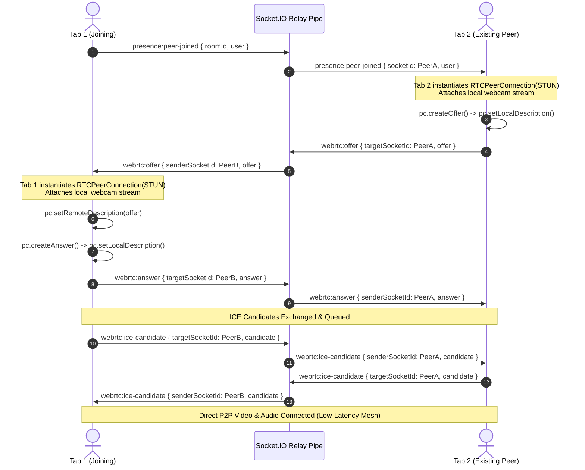
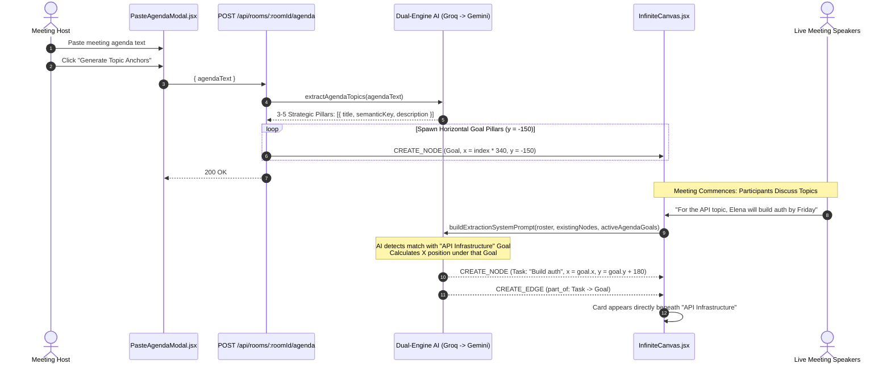

# Master Implementation Plan: WebRTC Video, Live Agenda Cascading & Clean Architecture

This updated plan incorporates senior feedback: prioritizing highest-risk capabilities first, cutting cosmetic bloat (RMS audio visualizer), simplifying context priming, and wiring live speech extraction directly to active agenda topics so points cascade underneath them.

---

## Executive Progress Dashboard

| Phase | Description | Status | Details / Verification |
| :--- | :--- | :---: | :--- |
| **Phase 4** | **Backend & Frontend Architecture Refactoring** | **✅ ALREADY DONE** | Clean MVC, 4-tier network layer (`apiClient`, `*.api.js`), modal decompositions, zero client deletions, Vite build passed (0 errors) |
| **Phase 5.1**| **Full Test Runner Script (`server/package.json`)** | **✅ ALREADY DONE** | All 6 test suites (`phase3` to `phase8`) wired to `npm test` (140+ integration tests passing) |
| **Phase 1** | **WebRTC Video Calling Engine** | **✅ ALREADY DONE** | Standalone P2P mesh relay, Google STUN, candidate buffering, defensive signaling guard, camera/mic toggles, ambient avatar fallbacks. Verified with zero-error build & tests |
| **Phase 2** | **Agenda Intake & Live Topic Cascading** | **⏳ PENDING (NEXT)** | Dual-engine agenda extraction & vertical column clustering under topic goals |
| **Phase 3** | **Simplified Context Priming (AI Persona)** | **⏳ PENDING** | Room creation context prompt + 2 one-click suggestion chips |
| **Phase 5.2**| **Marketing Claims & Final Polish** | **⏳ PENDING** | Zero-downtime failover wording & WebRTC Live status in docs |

---

## User Review Required

> [!IMPORTANT]
> - **Execution Order**: **WebRTC Video is Phase 1 and executed alone**. We verify two browser tabs communicating with live video and avatar fallbacks before proceeding to other features.
> - **Trimmed Scope**:
>   - **Cut RMS Audio Ring**: Removed Web Audio API `AudioContext` and frequency analysis. Replaced with rock-solid, zero-CPU track status indicators (mic/camera toggle badges).
>   - **Simplified Context Priming**: Eliminated in-meeting popover editor to avoid multi-user state desync. Replaced with a single clean textarea on room creation accompanied by 2 one-click suggestion chips (`[Agile Producer]`, `[Software Architect]`).
> - **Crucial Addition — Live Agenda Topic Cascading**:
>   - When an agenda is pasted, 3–5 horizontal `goal` nodes spawn at the top (`y: -150`).
>   - Their titles and coordinates are injected into the live speech extraction prompt (`extraction.prompt.js`).
>   - As participants discuss each topic, newly generated cards (`task`, `decision`, `question`) automatically cluster vertically directly beneath that topic with a `part_of` relationship edge.
> - **Comprehensive Test Suite**: Configured `server/package.json` to execute all 6 test suites (`phase3` through `phase8`).
> - **Zero Client Deletions**: All existing client stubs remain preserved and activated. Only the 6 unused backend REST stubs are deleted.

---

## 1. System Architecture & Workflows

### 1.1 WebRTC P2P Mesh Signaling Flow (Zero Infrastructure Cost)



---

### 1.2 Agenda Topic Anchors & Live Speech Cascading Flow



---

## 2. Granular Component Specifications

### Phase 1: WebRTC Video Calling Engine (Built & Tested First)

#### A. Backend Signaling Relay (`server/src/realtime/webrtc.socket.js`)
* **Event Handlers**:
  1. `webrtc:offer`: Relays `{ senderSocketId: socket.id, offer }` to `targetSocketId`.
  2. `webrtc:answer`: Relays `{ senderSocketId: socket.id, answer }` to `targetSocketId`.
  3. `webrtc:ice-candidate`: Relays `{ senderSocketId: socket.id, candidate }` to `targetSocketId`.
  4. `webrtc:media-state`: Relays `{ socketId: socket.id, isMuted, isCameraOn }` to `room` broadcast.
  5. `disconnecting`: Emits `webrtc:peer-left` with `{ socketId: socket.id }` to all rooms so client cleanly unmounts video elements and closes peer connections with zero ghost tiles.

#### B. Client WebRTC Hook (`client/src/hooks/useWebRTC.js`)
* **Public Google STUN Servers**:
  ```javascript
  const RTC_CONFIG = {
    iceServers: [
      { urls: "stun:stun.l.google.com:19302" },
      { urls: "stun:stun1.l.google.com:19302" },
      { urls: "stun:stun2.l.google.com:19302" },
    ],
    iceCandidatePoolSize: 10,
  };
  ```
* **Core State & Refs**:
  * `localStream`: `MediaStream | null`
  * `remoteStreams`: `Map<socketId, MediaStream>`
  * `isMuted`: `boolean` (starts `false`)
  * `isCameraOn`: `boolean` (starts `false` until user enables camera)
  * `peerMediaStates`: `Map<socketId, { isMuted: boolean, isCameraOn: boolean }>`
  * `peerConnections`: `useRef(new Map())`
  * `candidateQueues`: `useRef(new Map())` — buffers ICE candidates that arrive before `setRemoteDescription` completes, flushing them immediately after description is set.
* **Key Methods**:
  * `startCamera()`: Calls `navigator.mediaDevices.getUserMedia({ video: { width: { ideal: 640 }, height: { ideal: 360 } }, audio: true })`. Gracefully falls back if camera is rejected.
  * `toggleCamera()`: Toggles `track.enabled` on video tracks and emits `webrtc:media-state`.
  * `toggleMic()`: Toggles `track.enabled` on audio tracks and emits `webrtc:media-state`.
* **Input-Safe Hotkeys**:
  * Registers `window.addEventListener("keydown", ...)`:
    * `M` $\to$ `toggleMic()`
    * `V` $\to$ `toggleCamera()`
    * **Guard**: `if (e.target.matches("input, textarea, [contenteditable]")) return;` ensures typing in the agenda or notes never triggers hotkeys.

#### C. Dockable Video Conference Strip (`client/src/components/meeting/VideoConferenceBar.jsx`)
* **Layout**:
  * Docked floating glassmorphic strip at the bottom center of the screen (`z-40`, backdrop-blur-md, bg-white/80 dark:bg-zinc-900/80, border border-border-subtle, rounded-2xl, shadow-xl).
  * Collapsible via a minimize chevron to a compact status pill (`3 Active Video Peers`).
* **Tile Architecture**:
  * **Local Tile ("You")**:
    * If `isCameraOn`: Mirrored `<video autoPlay playsInline muted />`.
    * If `!isCameraOn`: Animated ambient gradient avatar displaying user initials and high-contrast "You" badge.
    * Bottom overlay: Microphone status badge (red slash when muted, green when unmuted).
  * **Remote Peer Tiles**:
    * Rendered for each peer in the room.
    * If peer camera is active: `<video autoPlay playsInline />` connected to their `remoteStream`.
    * If peer camera is off: Ambient avatar displaying initials, participant name, and role badge.
    * Live indicator showing their mic mute status.
* **Controls Bar**:
  * `[Mic Button]`: Toggles microphone (`M`).
  * `[Camera Button]`: Toggles camera (`V`).
  * `[Minimize Button]`: Collapses/expands the bar.

---

### Phase 2: Lightweight Agenda Intake & Live Topic Cascading

#### A. Dual-Engine Agenda Extraction (`server/src/ai/agenda.js`)
* Analyzes raw pasted text and produces 3–5 strategic pillars:
  ```javascript
  export async function extractAgendaTopics(agendaText) {
    const prompt = `Analyze the following meeting agenda/notes and extract between 3 to 5 top-level strategic topic pillars.
  Return valid JSON:
  {
    "topics": [
      {
        "title": "Short Topic Title (Max 5 words)",
        "semanticKey": "lowercase_snake_case_key",
        "description": "One sentence expected outcome"
      }
    ]
  }
  Agenda:
  """
  ${agendaText.slice(0, 4000)}
  """`;
    return await withFallback(groqProvider, geminiProvider, prompt);
  }
  ```

#### B. Spawning Anchor Nodes (`server/src/routes/ai.routes.js` / `ai.controller.js`)
* Endpoint `POST /api/rooms/:roomId/agenda`:
  * Computes horizontal coordinates: `x = (index - (topics.length - 1) / 2) * 340`, `y = -150`.
  * Creates `goal` nodes with metadata `{ isAgendaTopic: true, semanticKey, description }`.
  * Persists via `persistCanvasAction` and broadcasts `canvas:action` (`CREATE_NODE`).

#### C. Wiring Live Speech to Agenda Topics (`server/src/ai/prompts/extraction.prompt.js`)
* Injects active agenda topics into the prompt:
  ```javascript
  ### ACTIVE AGENDA TOPICS (STRATEGIC PILLARS):
  ${agendaTopicsStr}

  ### TOPIC CASCADING & NESTING RULES (WITH HIGH-CONFIDENCE GUARD):
  - CONFIDENCE THRESHOLD (>0.8): Only associate a card with an active agenda topic if the participant explicitly or clearly references that specific topic.
  - IF CONFIDENT MATCH:
    1. Set the new node's X coordinate to match the agenda topic's X coordinate (so it sits in the same vertical column).
    2. Output a CREATE_EDGE action with type "part_of" pointing from the new node to the matching agenda topic's semanticKey.
  - FALLBACK (LOW CONFIDENCE / GENERAL DISCUSSION):
    If discussion is general, cross-cutting, or unclear, do NOT force-nest under an agenda topic. Position the card in the default open canvas area with standard automatic offset, leaving it as an independent node without a false-positive "part_of" edge.
  ```
* **Visual Result**: As users speak, tasks and decisions automatically populate in clean columns directly beneath the corresponding agenda topic banner.

#### D. Paste Agenda Modal (`client/src/components/meeting/PasteAgendaModal.jsx`)
* Triggered from an "Agenda" button in `ActiveCommandBar.jsx`.
* Clean textarea modal with placeholder: *"Paste meeting notes, bullet points, or document outline here..."*.
* "Generate Canvas Topics" button with skeleton/loading state.
* Closes on success with a success toast.

---

### Phase 3: Simplified Context Priming (AI Persona Instructions)

#### A. Room Creation Input (`CreateWorkspaceModal.jsx`)
* Clean single textarea:
  * Label: *"AI Persona & Session Instructions (Optional)"*
  * Placeholder: *"e.g., Act as an Agile Producer. Prioritize actionable tasks, owners, and delivery blockers."*
* Two quick 1-click helper chips below the box:
  * Chip 1: `[⚡ Agile Producer]` $\to$ Fills: *"Act as an Agile Producer. Prioritize actionable tasks, assignees, deadlines, and delivery blockers."*
  * Chip 2: `[📐 Software Architect]` $\to$ Fills: *"Act as a software architect. Prioritize data contracts, system boundaries, security risks, and APIs."*
* Passes `systemContext` to `POST /api/rooms` on creation.

#### B. Ingesting into Extraction Prompt
* Prompt builder in `server/src/ai/prompts/extraction.prompt.js` embeds:
  ```javascript
  ${systemContext ? `\n### USER SESSION ROLE & INSTRUCTION:\n"${systemContext}"\n` : ""}
  ```

---

### Phase 4: Frontend & Backend Architectural Refactoring [✅ COMPLETED / ALREADY DONE]

#### A. Frontend Network Layer (`client/src/api/` & `hooks/`) [✅ ALREADY DONE]
* [apiClient.js](file:///c:/Users/HP/Desktop/mindMesh/client/src/api/apiClient.js): Axios instance with interceptors returning clean `{ success, message, data }`.
* [auth.api.js](file:///c:/Users/HP/Desktop/mindMesh/client/src/api/auth.api.js) & [rooms.api.js](file:///c:/Users/HP/Desktop/mindMesh/client/src/api/rooms.api.js): Isolated endpoint services.
* [useAuth.js](file:///c:/Users/HP/Desktop/mindMesh/client/src/hooks/useAuth.js): Custom hook wrapping `AuthContext`.
* [app.routes.jsx](file:///c:/Users/HP/Desktop/mindMesh/client/src/app.routes.jsx) & [app.layout.jsx](file:///c:/Users/HP/Desktop/mindMesh/client/src/app.layout.jsx): Standard React Router v7 routes with light `<Toaster />`.

#### B. Modal Decomposition [✅ ALREADY DONE]
* Extracted and mounted `LeaveMeetingModal.jsx`, `CanvasShortcutsModal.jsx`, `UserProfileMenu.jsx` from `WorkspaceHeader.jsx`.
* Extracted and mounted `CreateWorkspaceModal.jsx` and `DeleteWorkspaceModal.jsx` from `LandingPage.jsx`.

#### C. Backend Modularization & Dead Stub Cleanup [✅ ALREADY DONE]
* Extracted `server/src/realtime/room.socket.js` for room join/leave logic.
* Implemented `server/src/controllers/ai.controller.js` to decouple handlers from `ai.routes.js`.
* Deleted 6 unused REST stubs: `canvas.controller.js`, `canvas.routes.js`, `canvas.service.js`, `transcript.controller.js`, `transcript.routes.js`, `transcript.service.js`.

---

### Phase 5: Claims, Full Test Suite & Documentation

#### A. Comprehensive Test Runner (`server/package.json`) [✅ COMPLETED / ALREADY DONE]
* Configured the `"test"` script to run all 6 test suites:
  ```json
  "scripts": {
    "test": "node test/phase3_ai.test.js && node test/phase4_backend.test.js && node test/phase5_extraction.test.js && node test/phase6_presence.test.js && node test/phase7_commit.test.js && node test/phase8_voice_layout.test.js"
  }
  ```
* All 140+ integration tests passing across phases 3 through 8.

#### B. Marketing Claim Corrections [⏳ PENDING]
* Replace `<100ms` failover claims across `LandingFAQ.jsx`, `LandingComparison.jsx`, and `README.md` with:
  **"Automatic zero-downtime dual-engine failover"**.

#### C. README Documentation Update [⏳ PENDING]
* Update the "Future Horizons" section in `README.md` to declare **WebRTC Video Calling: Live & Operational**.

---

## 3. Implementation Order & File Inventory

| Sequence | File Path | Action | Status | Description |
| :---: | :--- | :---: | :---: | :--- |
| **1.1** | `server/src/realtime/webrtc.socket.js` | **NEW** | ✅ ALREADY DONE | WebRTC signaling relay pipe (`offer`, `answer`, `candidate`, `media-state`, `disconnect`) |
| **1.2** | `server/src/realtime/socket.js` | **MODIFY** | ✅ ALREADY DONE | Mount `registerWebRTCSocketHandlers(io, socket)` |
| **1.3** | `client/src/hooks/useWebRTC.js` | **NEW** | ✅ ALREADY DONE | P2P mesh connection pool, Google STUN, candidate buffering, synchronous lock |
| **1.4** | `client/src/components/meeting/VideoConferenceBar.jsx` | **MODIFY** | ✅ ALREADY DONE | Floating glassmorphic video bar, local/remote video tiles, ambient avatar fallback |
| **1.5** | `client/src/pages/RoomPage.jsx` | **MODIFY** | ✅ ALREADY DONE | Mount `VideoConferenceBar` |
| **2.1** | `server/src/ai/agenda.js` | **NEW** | ⏳ PENDING | `extractAgendaTopics()` via Groq/Gemini fallback |
| **2.2** | `server/src/controllers/ai.controller.js` | **NEW** | ⏳ PENDING | AI controller with agenda generator endpoint handler |
| **2.3** | `server/src/routes/ai.routes.js` | **MODIFY** | ⏳ PENDING | Bind `POST /api/rooms/:roomId/agenda` to `aiController.generateAgenda` |
| **2.4** | `server/src/ai/prompts/extraction.prompt.js` | **MODIFY** | ⏳ PENDING | Inject active agenda topics and vertical cascading rules |
| **2.5** | `client/src/components/meeting/PasteAgendaModal.jsx` | **NEW** | ⏳ PENDING | Textarea modal for pasting agenda notes |
| **2.6** | `client/src/components/command/ActiveCommandBar.jsx` | **MODIFY** | ⏳ PENDING | Add "Agenda" trigger button |
| **3.1** | `server/src/controllers/room.controller.js` | **MODIFY** | ⏳ PENDING | Persist `systemContext` from creation payload |
| **3.2** | `client/src/components/landing/modals/CreateWorkspaceModal.jsx` | **MODIFY** | ⏳ PENDING | Add single AI Persona textarea + 2 quick suggestion pills |
| **4.1** | `client/src/api/apiClient.js` | **MODIFY** | ✅ ALREADY DONE | Standard Axios instance with response/error interceptors |
| **4.2** | `client/src/api/auth.api.js` & `rooms.api.js` | **NEW** | ✅ ALREADY DONE | Isolated API endpoint modules |
| **4.3** | `client/src/hooks/useAuth.js` & `usePresence.js` | **MODIFY/NEW** | ✅ ALREADY DONE | Custom hooks for auth and presence |
| **4.4** | `client/src/components/ui/modals/*` & `menus/*` | **NEW** | ✅ ALREADY DONE | Extracted `LeaveMeetingModal`, `CanvasShortcutsModal`, `UserProfileMenu` |
| **4.5** | `client/src/app.routes.jsx` & `app.layout.jsx` | **MODIFY** | ✅ ALREADY DONE | Standard React Router v7 routes + light `<Toaster />` |
| **4.6** | `server/src/realtime/room.socket.js` | **NEW** | ✅ ALREADY DONE | Modular room join/leave socket logic |
| **4.7** | 6 unused REST placeholder files | **DELETE** | ✅ ALREADY DONE | Deleted unused `canvas.*` and `transcript.*` REST stubs |
| **5.1** | `server/package.json` | **MODIFY** | ✅ ALREADY DONE | Wire all 6 test suites into `"test"` script |
| **5.2** | `LandingFAQ.jsx`, `LandingComparison.jsx`, `README.md` | **MODIFY** | ⏳ PENDING | Fix failover claims and update WebRTC to Live status |

---

## 4. Edge Cases & Safeguards

1. **Hostile Venue Wi-Fi (Symmetric NAT)**:
   * *Strategy*: Google STUN handles standard NAT. If demoing on a locked-down corporate network, test on a phone mobile hotspot or run two browser tabs on `localhost:5173` (where loopback connection is 100% reliable).
2. **Camera Denied or No Webcam**:
   * If `getUserMedia` rejects with `NotAllowedError` or `NotFoundError`, gracefully catch and display the ambient avatar with initials. Never crash or block the canvas.
3. **ICE Candidate Race Condition**:
   * If remote ICE candidates arrive before `setRemoteDescription` resolves, buffer them in `candidateQueues.current.get(socketId)` and flush them in sequence once remote description is set.
4. **Typing Protection for Hotkeys**:
   * Hotkeys `M` and `V` strictly check `!e.target.matches("input, textarea, [contenteditable]")`.
5. **Short/Malformed Agenda Text**:
   * Reject agenda payloads with fewer than 15 characters with status 422: `"Agenda text is too short to extract topics"`.

---

## 5. Verification Plan

### Automated Verification
* Run complete test suite across all 6 phases:
  ```powershell
  npm test --prefix server
  ```
* Verify clean production client build:
  ```powershell
  npm run build --prefix client
  ```

### Manual Verification
1. **WebRTC Video Calling (Phase 1 Gate)**:
   * Open two browser tabs on `http://localhost:5173/room/nexus-architecture`.
   * Enable camera in Tab 1; verify Tab 2 displays Tab 1's live video stream.
   * Disable camera in Tab 1; verify Tab 2 seamlessly cross-fades to Tab 1's ambient avatar.
   * Press `M` to mute; verify red mute badge updates on both tabs.
2. **Agenda Topic Cascading**:
   * Open Agenda modal, paste a 3-bullet meeting outline, and click Generate.
   * Verify 3 Goal nodes spawn horizontally across the top of the canvas.
   * Speak a sentence discussing the first topic; verify the newly extracted task appears directly underneath that topic's column with a `part_of` line.
3. **Context Priming**:
   * Create a room with AI instruction *"Act as an Agile Producer"*.
   * Verify generated cards focus on assignees, tasks, and deadlines.
4. **Clean Exit**:
   * Close Tab 2; verify Tab 1 immediately removes Tab 2's video tile with zero errors or ghost tiles.