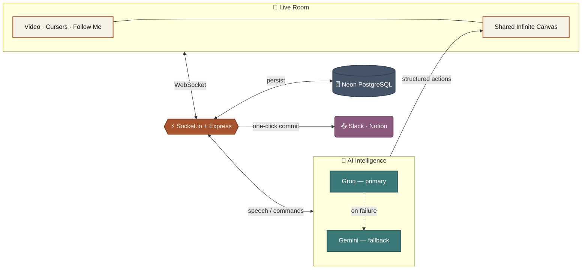

# mindMesh

<div align="center">

### The conversation becomes the canvas.

**An AI-native collaborative visual workspace that turns spoken dialogue into living, interactive knowledge maps in real time.**

[](https://mindmesh-s.vercel.app/)
[](https://mindmesh-gnyi.onrender.com/api/health)
[](LICENSE)
[](https://react.dev/)
[](https://nodejs.org/)
[](https://socket.io/)
[](https://neon.tech/)
[](https://groq.com/)
[](https://ai.google.dev/)

[Live App](https://mindmesh-s.vercel.app/) • [Quick Start](#-quick-start) • [Full Architecture & Deep Dive](ARCHITECTURE.md)

</div>

---

## 💡 The Problem

Traditional meetings suffer from a disconnect between **discussion** and **execution**:

```
Traditional:  🗣️ 45-Min Meeting ──► 📜 30-Page Transcript ──► 🗑️ Forgotten in Drive ──► ❓ Stalled Execution
mindMesh:     🗣️ Live Speech     ──► 🧠 Dual-Engine AI      ──► 🗺️ Structured Canvas  ──► 🚀 One-Click Commit
```

1. **Linear transcripts hide relational truth** — they can't show how one decision blocks a task, or how a single risk undermines three separate goals.
2. **Post-meeting synthesis is lossy and delayed** — summaries written hours later miss nuance and verbatim evidence.
3. **Action items disappear** — tasks mentioned in passing rarely get logged, assigned, or verified.

As the team speaks, mindMesh extracts structured knowledge entities, computes relational dependencies, lays them out on an infinite canvas, and commits actionable outcomes directly to Slack and Notion.

---

## ✨ What It Does

- **🎙️ Speech becomes canvas, live** — dictate or paste an agenda; the AI extracts goals, tasks, decisions, questions, and risks and places them on the board as you talk, with dual-provider (Groq + Gemini) failover so it never goes down mid-meeting.
- **🗣️ Natural-language canvas control** — tell the AI "tidy this up," "move risks to the right," "add a task for Marcus," or "visualize this," and it acts on the live canvas.
- **📹 Video + canvas in one surface** — peer-to-peer WebRTC video calling docked right alongside the board, not a separate tool.
- **👥 Real multiplayer** — live cursors, Follow Me presenter mode, and shared context zones, all synced in real time.
- **🧭 Evidence, not just notes** — every AI-created card traces back to the literal transcript quote that produced it ("Why This Exists").
- **🏁 One-click meeting commit** — synthesizes the canvas *and* the raw dialogue into an executive report, dispatched straight to Slack/Notion.
- **🔐 Actually hardened**, not just functional — rate limiting on every sensitive route and the AI command socket, room-scoped multiplayer authority, SSRF-safe integrations, and owner-gated RBAC. See [ARCHITECTURE.md](ARCHITECTURE.md#-production--cross-domain-hardening) for specifics and the honest list of what's still open.

For the full feature breakdown, system diagrams, data ontology, API/WebSocket reference, and engineering invariants, see **[ARCHITECTURE.md](ARCHITECTURE.md)**.

---

## 🏛️ Architecture at a Glance



*People talk → the AI understands → the canvas builds itself, live, for everyone in the room.* This is the 30-second version — the full system diagram (component-level, with the persistence/effector/idempotency layers) and the AI action sequence diagram are in [ARCHITECTURE.md](ARCHITECTURE.md#-system-architecture).

---

## 🚀 Quick Start

### 1. Prerequisites
- **Node.js** v18+ (v22/v24 recommended), **npm** v9+
- A [Neon](https://neon.tech) Serverless PostgreSQL database URL
- At least one API key from [Groq](https://console.groq.com) or [Google AI Studio](https://aistudio.google.com)

### 2. Backend
```bash
cd server
npm install
cp .env.example .env
# Fill in DATABASE_URL, GROQ_API_KEYS, GEMINI_API_KEYS (comma-separated for multi-key pools)

npx prisma migrate dev --name init
npm run prisma:seed   # seeds demo identities Elena Vance & Marcus Sterling
npm run dev            # Express + Socket.io on port 3000
```

### 3. Frontend
```bash
cd client
npm install
npm run dev             # Vite dev server on port 5173
```

Open `http://localhost:5173`.

> [!TIP]
> **Simulate a second collaborator**: open `http://localhost:5173?as=marcus` in another window (dev-only) to see live cursors, shared selection, and Follow Me broadcasting between two identities.

---

## 🌐 Live Deployment

- **Web App (Vercel)**: https://mindmesh-s.vercel.app/
- **API & WebSocket (Render)**: https://mindmesh-gnyi.onrender.com/
- **Health Check**: https://mindmesh-gnyi.onrender.com/api/health

Full step-by-step deployment instructions (env vars, build commands) are in [ARCHITECTURE.md](ARCHITECTURE.md#-production-deployment-render--vercel--neon).

---

## 🧪 Testing

The backend has 7 integration test scripts covering AI fallback, layout, extraction, presence, commit, and dedup logic — real code paths against a live database, not isolated unit tests. **There is currently no frontend test suite.** Full commands and an honest assessment of coverage are in [ARCHITECTURE.md](ARCHITECTURE.md#-backend-integration-test-suites).

---

## 👨‍💻 Author

Engineered by **Sahil Sameer** ([@SahilSameer18](https://github.com/SahilSameer18)).

## 📄 License

[ISC License](LICENSE).


