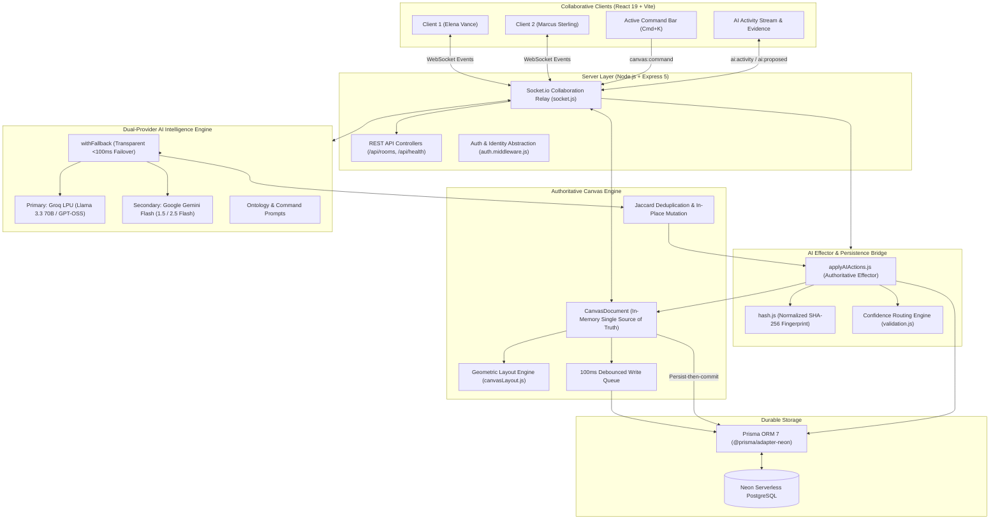
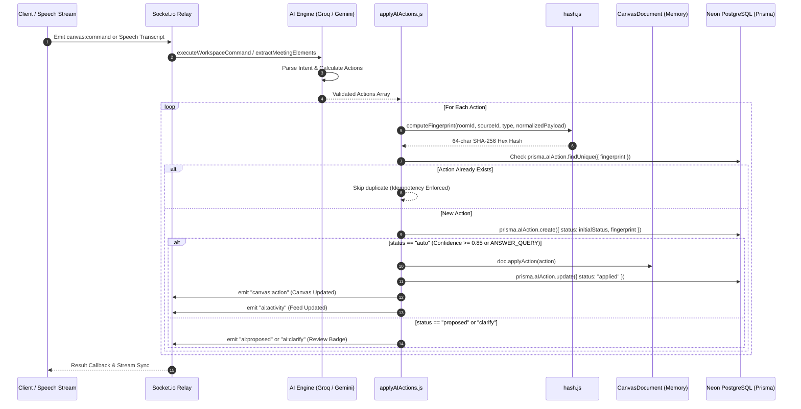
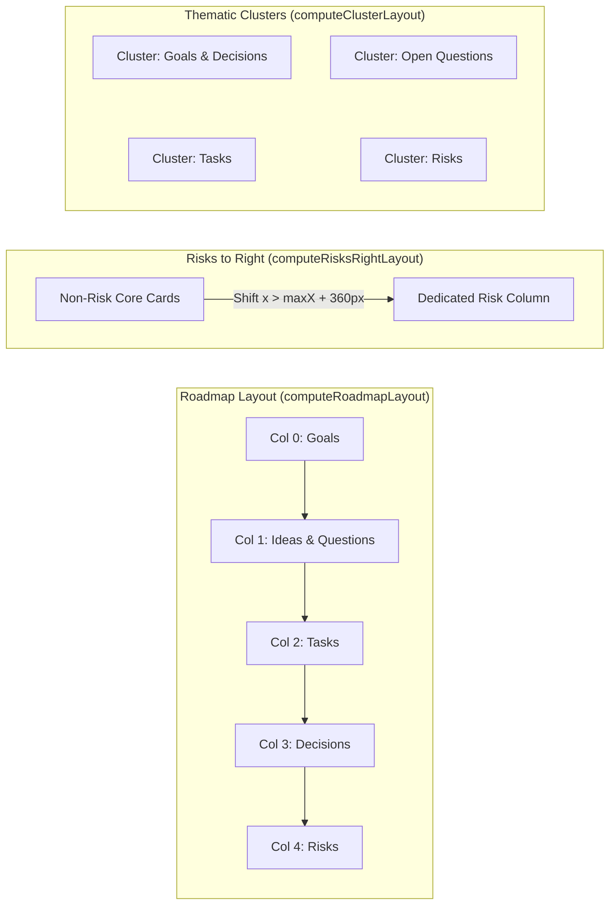

# mindMesh

> **The conversation becomes the canvas.**
> An AI-powered collaborative visual workspace where teams meet, think, and build together on a shared infinite canvas.

---

## Overview

**mindMesh** transforms real-time team dialogue into an interactive, interconnected knowledge graph. As participants speak or type, the system's dual-provider AI engine extracts goals, ideas, tasks, decisions, questions, and risks, calculating relational dependencies and laying them out geometrically on an infinite hardware-accelerated canvas.

---

## Development Roadmap & Status

| Phase | Description | Status | Key Deliverables |
| :---: | :--- | :---: | :--- |
| **Phase 1** | Foundation & Neon DB Persistence | ✅ Complete | 11 PostgreSQL Prisma models, Neon serverless adapter, demo seed data |
| **Phase 2** | Real-Time Authoritative Canvas Engine | ✅ Complete | In-memory `CanvasDocument`, 60fps pan/zoom, debounced batch writes, edge cascade |
| **Phase 3** | Dual-Provider AI Intelligence Engine | ✅ Complete | Groq + Gemini failover, candidate model resilience, Jaccard in-place mutation, confidence routing |
| **Phase 4** | Active Command Bar & AI Activity Stream | ✅ Complete | `Cmd+K` command bar, geometric layouts, live activity drawer, truthful Evidence cards (`sourceId`), query highlights |
| **Phase 5** | Speech Intelligence & Transcript Simulator | ⏳ Next | Stepped transcript playback, single-flight throttled queue ($\le 17$ RPM), custom JWT auth |
| **Phase 6** | Real-Time Audio & Video Collaboration | 📋 Planned | Daily.co / LiveKit room integration, active speaker detection, dynamic audio visualizer |
| **Phase 7** | Context Zones & Workspace Clustering | 📋 Planned | Spatial context zones, perimeter tagging, isolated cluster operations |
| **Phase 8** | Export, Polish & Production Hardening | 📋 Planned | High-res SVG/PNG export, end-to-end load testing, security audit |

---

## System Architecture



---

## AI Action Effector & Idempotency Pipeline



---

## Project Status & Implementation Phases

| Phase | Description | Status | Verification |
| :--- | :--- | :--- | :--- |
| **Phase 1: Foundation & Data Architecture** | 11 Prisma models, Neon Postgres WebSocket adapter, unified response format, Elena/Marcus demo identities, and seed data. | **Complete** | Database seeded & tested |
| **Phase 2: Canvas Engine & Socket Relay** | In-memory `CanvasDocument`, 60fps infinite hardware-accelerated canvas, persist-then-commit ordering, debounced drag queue, dual edge cascade. | **Complete** | Verified 60fps pan/zoom & socket sync |
| **Phase 3: AI Intelligence & Fallback** | Dual-provider LLM abstraction (Groq + Gemini Flash), `<100ms` failover, confidence routing (`auto`, `proposed`, `clarify`), Jaccard in-place mutation. | **Complete** | 19/19 automated test suite passing |
| **Phase 4: Active Commands & Effector** | AIAction persistence effector (`applyAIActions.js`), SHA-256 fingerprint idempotency, geometric layout engine (`canvasLayout.js`), command execution. | **Backend Complete** | 34/34 automated integration tests passing |
| **Phase 5: Simulator, Extraction & Custom Auth** | Continuous transcript simulator, single-flight coalescing queue ($\le 17$ RPM), and bcrypt/JWT cookie authentication. | Planned | Next phase |
| **Phase 6: Presence, Minimap & Meeting Modes** | Multiplayer live cursors, radar minimap, "Follow Me" presenter broadcast, Operational/Brainstorm modes. | Planned | Roadmap |
| **Phase 7: Generative Visuals & Integrations** | Pollinations.ai imagery, Meeting Commit flow (`MeetingReport`), and Slack/Notion/Resend integration. | Planned | Roadmap |
| **Phase 8: Voice, Video & Final Polish** | Web Speech API, Groq Whisper Large v3 Turbo, dockable video bar, Dagre hierarchical auto-layout. | Planned | Roadmap |

---

## Core Ontology

### 1. The 8 Canvas Node Types
- 🎯 **Goal** (`goal`): Strategic milestones, objectives, and sprint deliverables.
- 💡 **Idea** (`idea`): Creative proposals, exploratory thoughts, and hypotheses.
- 🟢 **Task** (`task`): Assignable action items with interactive completion checkboxes.
- 🔵 **Decision** (`decision`): Agreed architectural choices, approvals, and conclusions.
- 🟣 **Question** (`question`): Open inquiries, missing requirements, and clarification requests.
- 🔴 **Risk** (`risk`): Technical debt, third-party blockers, rate limits, and failure modes.
- 👤 **Person** (`person`): Active team members and stakeholders.
- 🖼️ **Visual** (`image`): Generative concept imagery and diagrams.

### 2. The 8 Edge Relationships
`blocks` · `depends_on` · `leads_to` · `supports` · `contradicts` · `related_to` · `assigned_to` · `part_of`

---

## Geometric Layout Engine

The mathematical layout engine ([`server/src/canvas/canvasLayout.js`](file:///c:/Users/HP/Desktop/mindMesh/server/src/canvas/canvasLayout.js)) calculates deterministic `(x, y)` coordinates for canvas reorganizations:



---

## Architectural Invariants & Guarantees

1. **Persist-Then-Commit Ordering**: All non-debounced canvas actions commit to Neon PostgreSQL before updating in-memory `CanvasDocument` state, preventing silent memory drift on database write errors.
2. **Deterministic Payload Hashing**: Object keys are sorted recursively via `normalizePayload()` before SHA-256 hashing (`roomId:sourceId:type:normalizedPayload`), enforcing the `@unique` constraint on `AIAction.fingerprint` and dropping duplicate network retries.
3. **Dual Edge Cascade**: Node deletion triggers an immediate in-memory sweep of all connected edges in `CanvasDocument`, mirrored atomically by `prisma.canvasEdge.deleteMany` in PostgreSQL.
4. **Phantom Resurrection Guard**: `MOVE_NODE` validates that target nodes exist before setting coordinates, preventing race conditions with concurrent deletions.
5. **Centralized Confidence Routing Policy**:
   - `confidence >= 0.85` or `ANSWER_QUERY` $\to$ `"auto"` (executed directly onto canvas).
   - `0.50 <= confidence < 0.85` $\to$ `"proposed"` (surfaced in AI Activity Stream with Apply/Dismiss chips).
   - `confidence < 0.50` $\to$ `"clarify"` (surfaced with amber review warning).
   - **Destructive Gating**: `DELETE_NODE` and `DELETE_EDGE` are permanently gated to `"proposed"`.
6. **Candidate Model Resilience**: The primary provider automatically falls back across available models (`config.groqModel`, `openai/gpt-oss-120b`, `openai/gpt-oss-20b`, `llama-3.3-70b-versatile`) on HTTP 404, gracefully surviving per-organization deprecations.
7. **End-to-End Data Lineage (`sourceId` Join Key)**: Both `CREATE_NODE` and `UPDATE_NODE` actions inject the authoritative `AIAction.id` into `CanvasNode.sourceId` and persist it to PostgreSQL, ensuring that Evidence Cards display true conversational rationale and verbatim `metadata.sourceQuote` across creation and live corrections.
8. **Chronological Stream Integrity**: Self-approval and live WebSocket action updates match by ID/fingerprint and update records in-place rather than unshifting, preventing approved actions from jumping to the top of the feed.

---

## Socket.io & REST API Reference

### Real-Time Socket Events

| Event Name | Direction | Payload / Description |
| :--- | :--- | :--- |
| `canvas:join` | Client $\to$ Server | `{ roomId, user }`: Joins room channel, returns authoritative state (`canvas:init`), broadcasts presence. |
| `canvas:action` | Bidirectional | `{ action }`: Atomic canvas action (`CREATE_NODE`, `UPDATE_NODE`, etc.). |
| `canvas:batch_action` | Bidirectional | `{ actions: [...] }`: Batch atomic action execution. |
| `canvas:command` | Client $\to$ Server | `{ prompt, workspaceContext }`: Natural language command (`"Move risks to the right"`, `"What did we decide?"`). |
| `canvas:command:result` | Server $\to$ Client | `{ intent, summary, answer, highlightedNodeIds, actions }`. |
| `ai:activity` | Server $\to$ Room | Live feed broadcast of applied `AIAction` row. |
| `ai:proposed` | Server $\to$ Room | Broadcast of proposed action requiring user approval. |
| `ai:clarify` | Server $\to$ Room | Broadcast of low-confidence action requiring clarification. |
| `ai:action:approve` | Client $\to$ Server | `{ actionId }`: User approves proposed action; applies to canvas and emits `ai:activity`. |
| `ai:action:reject` | Client $\to$ Server | `{ actionId }`: User dismisses proposed action; updates DB to `status: "rejected"`. |
| `cursor:move` | Client $\to$ Server | Throttled cursor coordinates `(x, y)` broadcast to peers as `cursor:moved`. |

### Unified REST Endpoints

All JSON endpoints strictly adhere to the unified format:
- **Success**: `{ "success": true, "message": "...", "data": { ... } }`
- **Failure**: `{ "success": false, "message": "...", "errors": [ ... ] }`

| Method | Endpoint | Description |
| :--- | :--- | :--- |
| `GET` | `/api/health` | Service health, uptime, and environment check. |
| `GET` | `/api/rooms/:roomId` | Room metadata and authorization check. |
| `GET` | `/api/rooms/:roomId/ai-actions` | Fetches recent `AIAction` history for Activity Stream hydration. |
| `POST` | `/api/rooms/:roomId/ai-actions/:actionId/approve` | Approves and executes a proposed action via REST. |
| `POST` | `/api/rooms/:roomId/ai-actions/:actionId/reject` | Rejects/dismisses a proposed action via REST. |

---

## Getting Started

### 1. Prerequisites
- Node.js (v18 or higher; v24 recommended)
- npm (v9+)
- A [Neon](https://neon.tech) Serverless PostgreSQL database URL
- At least one Groq or Google Gemini API key

### 2. Backend Setup
```bash
cd server

# Install dependencies
npm install

# Configure environment
cp .env.example .env
# Edit .env and configure:
# DATABASE_URL="postgresql://..."
# GROQ_API_KEYS="gsk_..."
# GEMINI_API_KEYS="AIzaSy..."

# Apply database migrations
npx prisma migrate dev --name init

# Seed database with demo identities (Elena Vance & Marcus Sterling)
npm run prisma:seed

# Run Phase 3 AI tests (19 checks)
node test/phase3_ai.test.js

# Run Phase 4 Backend tests (34 checks)
node test/phase4_backend.test.js

# Start backend server
npm run dev
```
The server will start on port `3000`. Test the health check at `http://localhost:3000/api/health`.

### 3. Frontend Setup
```bash
cd client

# Install dependencies
npm install

# Start Vite development server
npm run dev
```
Access the application at `http://localhost:5173`. Add `?as=marcus` to simulate multi-user collaboration in a second browser tab.

---

## Directory Structure

```
mindMesh/
├── client/                           # React 19 + Vite Frontend
│   ├── src/
│   │   ├── api/                      # REST & WebSocket client instances
│   │   ├── components/
│   │   │   ├── canvas/               # InfiniteCanvas, CanvasNode, CanvasEdge
│   │   │   ├── command/              # ActiveCommandBar (Floating OS bar)
│   │   │   ├── activity/             # ActivityStream & EvidenceCard
│   │   │   └── meeting/              # SpeechIntelligence & VideoConference
│   │   ├── context/                  # RoomContext (WebSockets & presence)
│   │   ├── hooks/                    # useCanvas, useAIActions, useSpeechRecognition
│   │   └── utils/                    # canvasConstants, color tokens
│   └── package.json
│
├── server/                           # Node.js + Express 5 Backend
│   ├── prisma/
│   │   ├── schema.prisma             # 11 PostgreSQL data models
│   │   └── seed.js                   # Demo users & room seeding
│   ├── src/
│   │   ├── ai/
│   │   │   ├── applyAIActions.js     # Effector service & DB persistence
│   │   │   ├── commands.js           # Workspace command execution engine
│   │   │   ├── validation.js         # Confidence routing & action sanitization
│   │   │   ├── prompts/              # Extraction & Command system prompts
│   │   │   └── providers/            # Groq & Gemini with transparent failover
│   │   ├── canvas/
│   │   │   ├── canvasDocument.js     # Authoritative in-memory state container
│   │   │   ├── canvasLayout.js       # Geometric spatial layout engine
│   │   │   ├── canvasDeduplication.js# Jaccard token & semanticKey in-place mutator
│   │   │   ├── canvasPersistence.js  # Neon PostgreSQL Prisma writer
│   │   │   └── canvasValidation.js   # Payload schema validators
│   │   ├── realtime/
│   │   │   ├── socket.js             # Socket.io server bootstrap
│   │   │   └── canvas.socket.js      # Real-time action, command & presence relays
│   │   ├── routes/                   # REST API routes (room, ai)
│   │   ├── utils/
│   │   │   ├── hash.js               # Normalized SHA-256 fingerprinting
│   │   │   └── response.js           # Unified JSON response formatters
│   │   └── app.js                    # Express app configuration & middleware
│   ├── test/
│   │   ├── phase3_ai.test.js         # 19 Phase 3 AI extraction tests
│   │   └── phase4_backend.test.js    # 34 Phase 4 backend integration tests
│   └── package.json
│
├── ROADMAP.md                        # Master 8-Phase Architectural Plan
├── implementation-plan.md            # Comprehensive technical design document
└── README.md                         # This document
```

---

## Author

Designed and engineered by **Sahil Sameer** ([@SahilSameer18](https://github.com/SahilSameer18)).

---

## License

ISC License
