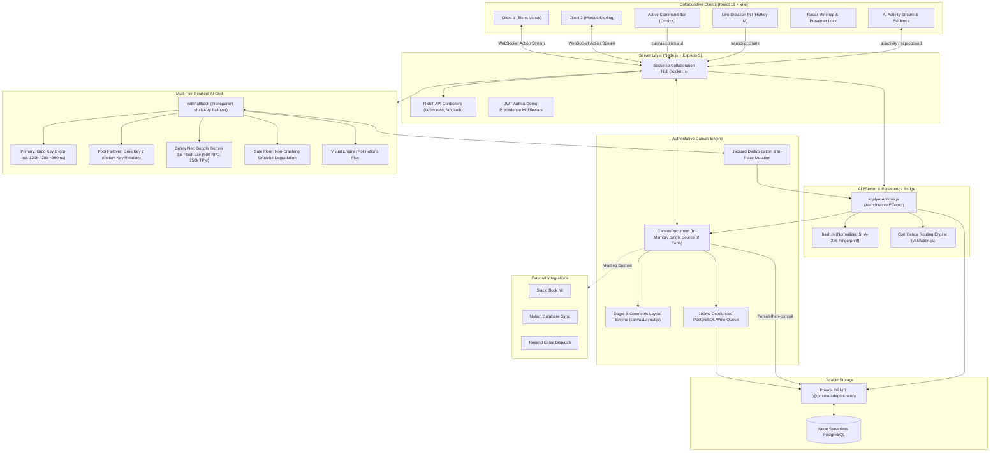
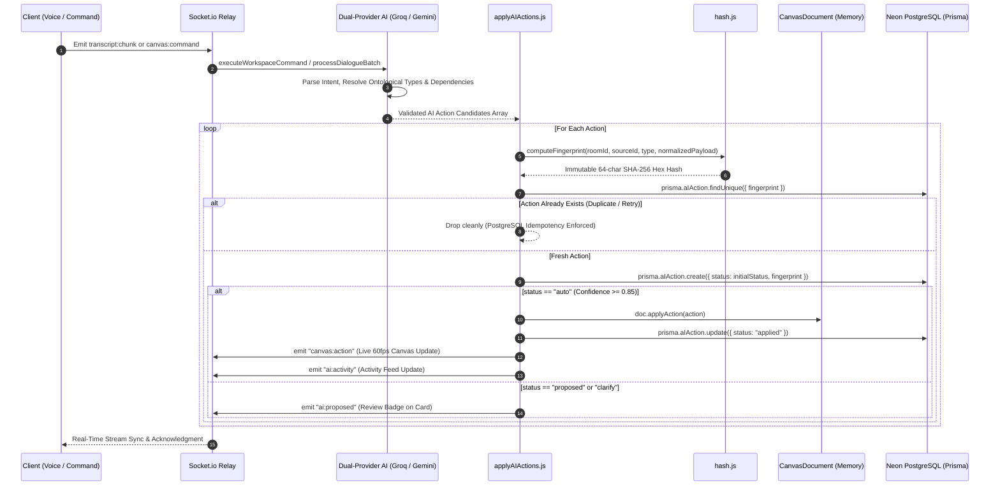

# mindMesh

<div align="center">

```
  ███╗   ███╗██╗███╗   ██╗██████╗ ███╗   ███╗███████╗███████╗██╗  ██╗
  ████╗ ████║██║████╗  ██║██╔══██╗████╗ ████║██╔════╝██╔════╝██║  ██║
  ██╔████╔██║██║██╔██╗ ██║██║  ██║██╔████╔██║█████╗  ███████╗███████║
  ██║╚██╔╝██║██║██║╚██╗██║██║  ██║██║╚██╔╝██║██╔══╝  ╚════██║██╔══██║
  ██║ ╚═╝ ██║██║██║ ╚████║██████╔╝██║ ╚═╝ ██║███████╗███████║██║  ██║
  ╚═╝     ╚═╝╚═╝╚═╝  ╚═══╝╚═════╝ ╚═╝     ╚═╝╚══════╝╚══════╝╚═╝  ╚═╝
```

### The conversation becomes the canvas.

**An AI-native collaborative visual workspace that turns spoken dialogue into living, interactive knowledge maps in real time.**

[](https://opensource.org/licenses/ISC)
[](https://react.dev/)
[](https://vitejs.dev/)
[](https://nodejs.org/)
[](https://expressjs.com/)
[](https://socket.io/)
[](https://neon.tech/)
[](https://www.prisma.io/)
[](https://groq.com/)
[-4285F4.svg?style=flat-square&logo=google)](https://ai.google.dev/)
[](https://github.com/SahilSameer18/mindMesh)

[Quick Start](#-quick-start) • [Product Tour](#-product-tour) • [System Architecture](#-system-architecture) • [Engineering Invariants](#-hardened-engineering-invariants) • [Ontology](#-the-canvas-knowledge-ontology) • [API Reference](#-api--websocket-reference)

---

</div>

## 💡 The Problem: Why Meetings Die in Transcripts

Traditional meetings suffer from a fundamental disconnect between **discussion** and **execution**:

```
Traditional Flow:
  🗣️ 45-Min Meeting ──► 📜 30-Page Wall of Text ──► 🗑️ Forgotten in Drive ──► ❓ Stalled Execution

mindMesh Flow:
  🗣️ Live Speech     ──► 🧠 Dual-Engine AI      ──► 🗺️ Structured Canvas ──► 🚀 One-Click Commit
  (Microphone/Stream)     (Groq + Gemini Failover)    (Dagre Layout Engine)      (Slack, Notion, Resend)
```

1. **Linear transcripts hide relational truth**: Transcripts are chronological logs. They cannot show how an architectural decision blocks a backend task, or how a single technical risk undermines three separate sprint goals.
2. **Post-meeting synthesis is lossy and delayed**: Summaries written hours after a call miss critical nuance, drop speaker attribution, and lack verbatim conversational evidence.
3. **Action items disappear into ether**: Tasks mentioned in passing are rarely logged, assigned, or verified before participants hang up.

**mindMesh solves this fundamentally.** As team members speak, an intelligent background pipeline extracts structured knowledge entities, computes relational dependencies, lays them out on an infinite hardware-accelerated canvas, and commits actionable outcomes directly to enterprise tools.

---

## 🗺️ Product Tour

### 1. 🎙️ Live Speech-to-Graph Synthesis
- **Zero-Friction Dictation**: Click the **Dictate** button in the header or hit **`M`** to toggle continuous voice dictation with browser silence recovery.
- **Interim Caption Stream (<10ms)**: Watch your spoken words stream into an ethereal floating pill right above the active command bar before they materialize into graph cards.
- **Background Speech Simulator**: Test real-time intelligence with 4 pre-loaded benchmark scenarios (*Canonical Onboarding Debate*, *Live Reassignment & In-Place Correction*, *Architecture & Risk Mitigation*, *Fluff Filter vs. Action Marker*).

### 2. ⚡ Multi-Key Resilient AI Grid (Zero-Downtime Failover)
- **Primary Engine**: Dual-Key Groq LPU pool running **Llama 3.3 70B / GPT-OSS 120B & 20B** for lightning-fast structured JSON inference (500–1,000 tokens/sec, ~300ms latency). Key rotation and burst failover provide **60 RPM** and **2,000 RPD** (1,000 RPD per key).
- **Secondary Safety Net**: Google **Gemini 3.5 Flash Lite** transparently absorbs high-volume dialogue spikes with **500 RPD**, **250,000 TPM**, and sub-second latency (benchmarked locally at ~926ms).
- **Zero-Crash Graceful Degradation**: If all upstream LLMs are unavailable, live speech extraction degrades safely without crashing the room (`status: "failed"` with empty action set), while the Meeting Commit Engine falls back to an authoritative deterministic qualitative summary (`generateDeterministicSummary`).
- **Confidence Routing**:
  - High confidence ($\ge 0.85$): Auto-applied to the canvas instantly.
  - Medium confidence ($0.50 - 0.85$): Displayed in the collapsible AI Activity Stream with one-click **Apply** / **Dismiss** chips.
  - Low confidence ($< 0.50$): Highlighted with an amber review warning.

### 3. 📋 Strategic Agenda Intake & Live Topic Cascading
- **Pre-Meeting & Live Agenda Ingestion**: Click the **Agenda** button in the workspace header to open the glassmorphic **Paste Agenda Modal**. Paste raw markdown bullets, sprint notes, or Jira deliverables.
- **Automatic Pillar Extraction**: The AI extracts 3–5 top-level strategic topic pillars (`type: "goal"`), positioning them horizontally as anchor roots across the top of the canvas ($y = 0$).
- **Live Dialogue Cascading (Vertical Hierarchical Trees)**: As attendees speak, newly extracted tasks, decisions, and risks automatically link to their parent agenda pillar via `part_of` or `depends_on` directed edges, forming clear downward visual trees.
- **Three-Layer Defense-in-Depth**: Engineered with strict schema validation (`fromSemanticKey`/`toSemanticKey`), action validation key normalization, and canvas deduplication fallback so parent-child relationships never break.

### 4. 📐 Server-Authoritative Dagre Layout Engine
- **Kahn's Topological Sort (Diamond-Safe)**: Ensures prerequisite parent cards are fully ranked before dependent children ($A \to B, A \to C, B \to D, C \to D \implies \text{rank}(D) = 2$).
- **3-Color DFS Cycle Breaking**: Safely detects back-edges (`WHITE`, `GRAY`, `BLACK`) to eliminate circular dependencies without recursion crashes.
- **Barycentric Crossing Minimization**: Orders nodes horizontally within each tier by averaging predecessor X coordinates.
- **Collision-Free Geometry**: Spaced strictly by $360\text{px} \times 200\text{px}$ strides ($280\times140\text{px}$ cards), mathematically guaranteeing zero overlap.
- **One-Click Tidy**: Click the **Tidy Graph** button on the floating toolbar or type `/layout hierarchical` in the command bar.

### 5. 🎨 Generative Visual Concepts (Pollinations.ai)
- Visual cards (`node.type === "image"`) render high-resolution architectural diagrams and creative concept artwork inline on the canvas.
- Click any visual card to launch the **Visual Lightbox Inspection Modal** for full-resolution view, prompt inspection, and downloads.
- Automatic retry lifecycle with jitter and fallback rendering on slow network connections.

### 6. 👥 Multiplayer Presence & Radar Minimap
- **60fps Cursors**: Canvas-space transformed cursors throttled to 35ms with smooth CSS transform interpolation and name badges.
- **Radar Minimap**: Bottom-right interactive radar projecting all canvas cards and peer viewports; click or drag anywhere to jump instantly.
- **Follow Me Presenter Broadcast**: Single-presenter concurrency lock allows a speaker to guide all attendees' viewports with trailing-edge sync.
- **Dual Meeting Modes**:
  - **Operational**: Structured columns, task assignments, and chronological deliverables.
  - **Brainstorm**: Organic visual clustering and associative idea maps.

### 7. 📹 Peer-to-Peer WebRTC Video Calling
- **Low-Latency P2P Mesh**: Audio and video streams flow directly between attendee browsers via Google STUN servers with zero server media bandwidth overhead.
- **Dockable Video Conference Bar**: Floating glassmorphic dock positioned above the canvas, featuring mirrored local video, remote peer tiles, and live mic status indicators.
- **Ambient Avatar Fallbacks**: Graceful fallback to initialed colored avatars if cameras are disabled or permission is denied, ensuring attendees are always visually represented.
- **Synchronous Signaling Locks**: Hardened against duplicate offer collisions and out-of-order ICE candidate trickling.

### 8. 🏁 Dual-Source Meeting Commit & External Integrations
- Click **Commit Call** to synthesize both the **final canvas knowledge graph** and **raw conversational dialogue** into an executive `MeetingReport`.
- Celebratory dual-cannon confetti animation upon commit confirmation.
- Direct outward dispatches:
  - 💬 **Slack**: Formatted Block Kit payload.
  - 📝 **Notion**: Complete database page and block hierarchy.

### 9. 🌐 Enterprise Landing Page & Brand Architecture
- **Proprietary Geometric Brand Mark**: Interconnected neural knowledge mesh SVG icon scalable across browser favicons, navigation bars, and authentication dialogs.
- **Fixed Glassmorphic Navigation**: Sticky top navigation that shifts from minimalist glass to an elevated translucent backdrop (`backdrop-blur-xl`) upon scroll.
- **Silky-Smooth Q&A Accordion**: Zero-jitter CSS Grid fractional height transitions (`grid-template-rows: 0fr ↔ 1fr`) with coordinated chevron rotations.
- **100% Mobile-First Responsiveness**: Tailored layout hierarchies across 320px mobile viewports, tablets, and 4K desktop screens with zero horizontal overflow.
- **Modern Routing Pipeline**: Standard React Router v7 DOM navigation (`/` and `/room/:roomId`) with backward-compatible room query strings.

---

## 🏛️ System Architecture



---

## ⚡ Real-Time AI Action & Idempotency Pipeline



---

## 🧭 The Canvas Knowledge Ontology

mindMesh classifies every piece of conversational intelligence into **8 distinct node types** and connects them through **8 semantic relationship edges**:

### Node Types

| Type | Icon | Color Accent | Purpose & Behavior |
| :--- | :---: | :---: | :--- |
| **Goal** | 🎯 | Sky Blue | Strategic milestones, high-level objectives, and sprint deliverables. |
| **Idea** | 💡 | Amber | Creative concepts, exploratory thoughts, architectural hypotheses. |
| **Task** | 🟢 | Emerald | Assignable action items with interactive completion checkboxes. |
| **Decision** | 🔵 | Violet | Finalized architectural choices, consensus agreements, approvals. |
| **Question** | 🟣 | Fuchsia | Open inquiries, missing requirements, clarification requests. |
| **Risk** | 🔴 | Rose | Technical debt, blockers, single points of failure, security risks. |
| **Person** | 👤 | Slate | Stakeholders, meeting participants, and action item assignees. |
| **Visual** | 🖼️ | Indigo | Generative diagrams, system mockups, visual concept cards. |

### Edge Relationships

```
┌──────────────────────────────────────────────────────────────────────────┐
│  • blocks       (Prerequisite blocker between tasks/risks)                │
│  • depends_on   (Directed dependency requirement)                        │
│  • leads_to     (Causal chain or sequential outcome)                     │
│  • supports     (Evidence or rationale supporting an idea/decision)      │
│  • contradicts  (Conflicting viewpoint or architectural objection)       │
│  • related_to   (Associative connection between related topics)          │
│  • assigned_to  (Person-to-Task ownership edge)                          │
│  • part_of      (Hierarchical decomposition into a goal or cluster)      │
└──────────────────────────────────────────────────────────────────────────┘
```

---

## 🛡️ Hardened Engineering Invariants

1. **Persist-Then-Commit Ordering**: All non-debounced canvas actions persist to Neon PostgreSQL before updating in-memory `CanvasDocument` state. This prevents silent memory drift if a database write fails.
2. **Deterministic Payload Hashing**: Object keys are recursively sorted via `normalizePayload()` before SHA-256 fingerprinting (`roomId:sourceId:type:normalizedPayload`). Duplicated network packets or retry attempts are idempotently ignored.
3. **Single-Flight Coalescing Queue ($\le 17$ RPM)**: Guarantees that only 1 speech extraction request is in flight per room at any time, protecting free-tier LLM rate limits while preserving conversation order.
4. **9-Second Monologue Ceiling Window**: Long continuous single-speaker utterances force-flush extraction within 9 seconds, preventing delayed graph updates.
5. **Signal-Safe Fluff Filter**: Discards filler (*"yeah"*, *"uh-huh"*, *"sounds good"*) to conserve 30–40% token quota while strictly safeguarding decision handoffs with `ACTION_MARKERS` (*"not"*, *"instead"*, *"assign"*, *"wait"*, *"actually"*).
6. **Diamond-Safe Topological Dagre**: The layout engine calculates ranks using Kahn's topological sort with in-degree queues, ensuring diamond sinks ($A \to B, A \to C, B \to D, C \to D$) are placed at rank 2, never prematurely at rank 1.
7. **Collision-Free Coordinates**: Spaced by $360\text{px} \times 200\text{px}$ strides ($280\times140\text{px}$ cards), mathematically guaranteeing $|x_i - x_j| \ge 280\text{px}$ or $|y_i - y_j| \ge 140\text{px}$ across all node pairs.
8. **End-to-End Data Lineage (`sourceId`)**: Nodes store their originating `AIAction.id` in `CanvasNode.sourceId`, allowing clicking any card's "Why This Exists" button to display the verbatim transcript quote and conversational reasoning.
9. **Rule 7 Loading State Polish**: 100% shimmering skeleton loaders across canvas load states, visual lightbox, and command reasoning bars; zero raw circular loading spinners.

---

## 🚀 Quick Start

### 1. Prerequisites
- **Node.js** (v18 or higher; v22/v24 recommended)
- **npm** (v9+)
- A [Neon](https://neon.tech) Serverless PostgreSQL database URL
- At least one API key from [Groq](https://console.groq.com) or [Google AI Studio](https://aistudio.google.com)

### 2. Backend Setup
```bash
# Navigate to backend
cd server

# Install dependencies
npm install

# Configure environment variables
cp .env.example .env
# DATABASE_URL="postgresql://..."
# GROQ_API_KEYS="gsk_key1,gsk_key2"       # Comma-separated multi-key pool (round-robin + burst failover)
# GEMINI_API_KEYS="AIzaSy..."             # Gemini 3.5 Flash Lite (500 RPD safety net)

# Apply Prisma database schema
npx prisma migrate dev --name init

# Seed database with demo identities (Elena Vance & Marcus Sterling)
npm run prisma:seed

# Start Express + Socket.io backend (Port 3000)
npm run dev
```

### 3. Frontend Setup
```bash
# In a new terminal, navigate to client
cd client

# Install dependencies
npm install

# Start Vite development server (Port 5173)
npm run dev
```

Open `http://localhost:5173` in your browser.

> [!TIP]
> **Multi-User Collaboration Simulation**: Open a second browser window at `http://localhost:5173?as=marcus`. You will instantly see Elena and Marcus collaborating with live canvas cursors, shared selection states, and presenter follow-me broadcasting!

---

## 🧪 Comprehensive Test Suites (130+ Passing)

The repository features comprehensive automated test suites validating every layer of the stack:

```bash
cd server

# Phase 3: AI Fallback, Confidence Routing & Jaccard Mutation (19 tests)
node test/phase3_ai.test.js

# Phase 4: Command Bar, Layout Engine & AIAction Persistence (34 tests)
node test/phase4_backend.test.js

# Phase 7: Dual-Source Meeting Commit, Confetti & Integrations (42 tests)
node test/phase7_commit.test.js

# Phase 8: Dagre Topological Sort, Diamond Dependencies & Voice Commands (36 tests)
node --test test/phase8_voice_layout.test.js
```

---

## 📡 API & WebSocket Reference

### Unified REST Response Contract
All endpoints strictly adhere to the unified JSON schema:
- **Success**: `{ "success": true, "message": "...", "data": { ... } }`
- **Failure**: `{ "success": false, "message": "...", "errors": [ ... ] }`

### Core REST Endpoints

| Method | Endpoint | Description |
| :--- | :--- | :--- |
| `GET` | `/api/health` | Service uptime, database connection, and environment health check. |
| `GET` | `/api/rooms/:roomId` | Room metadata, active participant count, and canvas authorization. |
| `GET` | `/api/rooms/:roomId/ai-actions` | Fetches historical `AIAction` feed for Activity Stream hydration. |
| `POST` | `/api/rooms/:roomId/ai-actions/:id/approve` | Approves and executes a proposed action via REST. |
| `POST` | `/api/rooms/:roomId/ai-actions/:id/reject` | Dismisses a proposed action and marks it `rejected`. |
| `POST` | `/api/rooms/:roomId/agenda` | Ingests meeting agenda, extracts 3–5 strategic pillars, and seeds anchor roots. |
| `POST` | `/api/auth/login` | Issues 7-day `httpOnly` JWT session cookie. |

### Real-Time Socket.io Events

| Event Name | Direction | Payload & Description |
| :--- | :---: | :--- |
| `canvas:join` | `C ──► S` | `{ roomId, user }`: Joins room, returns authoritative `canvas:init`, broadcasts presence. |
| `canvas:action` | `C ◄──► S` | `{ action }`: Atomic canvas mutation (`CREATE_NODE`, `MOVE_NODE`, etc.). |
| `canvas:batch_action` | `C ◄──► S` | `{ actions: [...] }`: Batch transactional canvas mutations. |
| `canvas:command` | `C ──► S` | `{ prompt, workspaceContext }`: Natural language command (`"/layout hierarchical"`). |
| `transcript:chunk` | `C ──► S` | `{ roomId, chunk: { id, speaker, text, timestamp } }`: Live speech stream. |
| `cursor:move` | `C ──► S` | Throttled `(x, y)` coordinates broadcast to peers as `cursor:moved`. |
| `presence:presenter-start` | `C ──► S` | Requests atomic single-presenter broadcast lock. |
| `ai:activity` | `S ──► C` | Real-time broadcast of newly applied `AIAction` row. |
| `ai:proposed` | `S ──► C` | Broadcast of action requiring user review and approval. |
| `webrtc:offer` | `C ◄──► S` | Relays SDP offer to target peer socket ID. |
| `webrtc:answer` | `C ◄──► S` | Relays SDP answer to offering peer socket ID. |
| `webrtc:ice-candidate` | `C ◄──► S` | Relays trickling ICE candidates to target peer. |
| `webrtc:media-state` | `C ──► S` | Broadcasts mic mute and camera toggle status to room. |
| `webrtc:peer-left` | `S ──► C` | Notifies room peers on disconnect to clean up video elements. |

---

## 📹 WebRTC Video Calling: Live & Operational

Peer-to-peer WebRTC video conferencing is fully operational in mindMesh:
- **Low-Latency P2P Mesh**: Audio/video streams exchange directly between peer browsers via public Google STUN servers.
- **Zero Server Media Overhead**: Node.js backend acts purely as an ephemeral signaling relay for SDP offers, answers, and ICE candidates.
- **Ambient Presence**: Integrated with room presence; auto-reconnects and cleanly unmounts video elements on disconnect with zero ghost tiles.

For the full architectural specification and signaling sequence, see [**`WEBRTC.md`**](WEBRTC.md).

---

## 📁 Repository Structure

```
mindMesh/
├── client/                               # React 19 + Vite Frontend
│   ├── src/
│   │   ├── api/                          # REST & WebSocket client instances
│   │   ├── components/
│   │   │   ├── landing/                  # Navbar, Hero, HowItWorks, Workspaces, Comparison, FAQ, Footer
│   │   │   ├── canvas/                   # InfiniteCanvas, CanvasNode, CanvasEdge, VisualLightboxModal
│   │   │   ├── command/                  # ActiveCommandBar (Floating OS bar)
│   │   │   ├── activity/                 # ActivityStream & EvidenceCard
│   │   │   ├── meeting/                  # SpeechIntelligenceController, CommitCallModal, PasteAgendaModal
│   │   │   ├── webrtc/                   # VideoConferenceDock (Floating P2P video mesh bar)
│   │   │   └── ui/                       # BrandLogo, WorkspaceHeader, Minimap, Avatar
│   │   ├── context/                      # RoomContext, AuthContext
│   │   ├── hooks/                        # useCanvas, useAIActions, useSpeechRecognition, useWebRTC
│   │   ├── pages/                        # LandingPage
│   │   ├── app.routes.jsx                # React Router v7 routes & navigation hooks
│   │   └── utils/                        # canvasConstants, color tokens
│   └── package.json
│
├── server/                               # Node.js + Express 5 Backend
│   ├── prisma/
│   │   ├── schema.prisma                 # 11 PostgreSQL data models
│   │   └── seed.js                       # Elena & Marcus demo seeding
│   ├── src/
│   │   ├── ai/
│   │   │   ├── applyAIActions.js         # Authoritative Effector service & DB persistence
│   │   │   ├── agenda.js                 # Strategic agenda pillar extraction service
│   │   │   ├── extraction.js             # Live speech-to-graph extraction engine
│   │   │   ├── commands.js               # Workspace command execution engine
│   │   │   ├── validation.js             # Confidence routing & 3-layer key sanitization
│   │   │   ├── prompts/                  # extraction, agenda, command & summary prompts
│   │   │   └── providers/                # Groq (Dual-Key) & Gemini (3.5 Flash Lite) with failover
│   │   ├── canvas/
│   │   │   ├── canvasDocument.js         # In-memory single source of truth
│   │   │   ├── canvasLayout.js           # Dagre & Geometric spatial layout engine
│   │   │   ├── canvasDeduplication.js    # Jaccard token & semanticKey mutator
│   │   │   ├── canvasPersistence.js      # Neon PostgreSQL Prisma writer
│   │   │   └── canvasValidation.js       # Payload schema validators
│   │   ├── realtime/
│   │   │   ├── socket.js                 # Socket.io server bootstrap
│   │   │   ├── canvas.socket.js          # Canvas action & command relays
│   │   │   └── presence.socket.js        # Multiplayer cursor & presenter relays
│   │   ├── routes/                       # REST API routes (room, ai, auth, commit)
│   │   ├── utils/
│   │   │   ├── hash.js                   # Normalized SHA-256 fingerprinting
│   │   │   └── response.js               # Unified JSON response formatters
│   │   └── app.js                        # Express app configuration & middleware
│   ├── test/
│   │   ├── phase3_ai.test.js             # 19 Phase 3 AI extraction tests
│   │   ├── phase4_backend.test.js        # 34 Phase 4 backend integration tests
│   │   ├── phase7_commit.test.js         # 42 Phase 7 commit & integration tests
│   │   └── phase8_voice_layout.test.js   # 36 Phase 8 Dagre & command tests
│   └── package.json
│
├── WEBRTC.md                             # Full WebRTC P2P Video Calling Architecture Specification
├── ROADMAP.md                            # Master 8-Phase Architectural Plan
└── README.md                             # Production Showcase & Documentation
```

---

## 👨‍💻 Author & Acknowledgments

Engineered by **Sahil Sameer** ([@SahilSameer18](https://github.com/SahilSameer18)).

---

## 📄 License

This project is licensed under the [ISC License](LICENSE).
